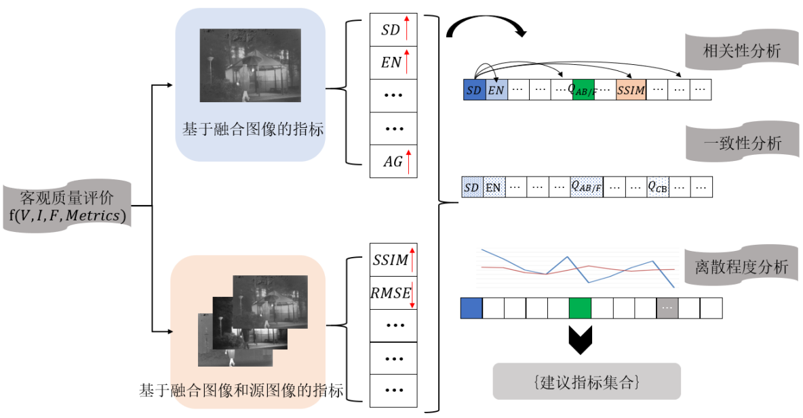

# 可见光与红外图像融合质量评价指标分析
## 目的
客观评价作为图像融合的重要研究领域，是评价融合算法性能的有力工具。目前，已有几十种不同类型的评价指标，但各应用领域包括可见光与红外图像融合，仍缺少统一的选择依据。为了方便比较不同融合算法性能，提出一种客观评价指标的通用分析方法并应用于可见光与红外图像融合。
## 方法
将可见光与红外图像基准数据集中的客观评价指标分为两类，分别是基于融合图像的评价指标与基于源图像和融合图像的评价指标。采用Kendall相关系数分析融合指标间的相关性，聚类得到指标分组；采用Borda计数排序法统计算法的综合排序，分析单一指标排序和综合排序的相关性，得到一致性较高的指标集合；采用离散系数分析指标均值随不同算法的波动程度，选择充分体现不同算法间差异的指标；综合相关性分析、一致性分析及离散系数分析，总结具有代表性的建议指标集合。
## 结果
在13对彩色可见光与红外和8对灰度可见光与红外两组图像源中，分别统计分析不同图像融合算法的客观评价数据，得到可见光与红外图像融合的建议指标集(标准差、边缘保持度)，作为融合算法性能评估的重要参考。相较于现有方法，实验覆盖20种融合算法和13种客观评价指标，并且不依赖主观评价结果。
## 结论
针对可见光与红外图像融合，提出了一种基于统计分析的客观评价指标分析方法，该方法可以推广至更多的图像融合应用，指导选择具有代表性的客观评价指标。

图1

图像融合客观指标分析的流程如图1所示。通过相关性分析和聚类得到指标分组，设计不受分组干扰的投票法统计算法的综合排序，分析单一指标排序和综合排序的相关性，得到一致性较高的指标集合；利用离散程度分析指标随不同算法的波动程度，选择充分体现不同算法间差异的指标。在图像融合实验基础上，综合相关性分析、一致性分析及离散程度分析，得到适用于可见光和红外图像融合的{建议指标集合}。

针对有限样本在实验设定下得到的建议指标集合是非排他性的指标建议,即选择多个指标从不同角度综合评价融合结果时，建议选择而非只选择的指标集合。相关领域研究者可将方法推广至多聚焦图像、医学图像以及遥感图像融合，得到适用于不同应用场景的图像融合客观评价指标建议。
## 引用信息
孙彬, 高云翔, 诸葛吴为, 王梓萱. 可见光与红外图像融合质量评价指标分析[J]. 中国图象图形学报, 2023,28(1):144-155. DOI： 10.11834/jig.210719.

Bin Sun, Yunxiang Gao, Wuwei Zhuge, Zixuan Wang. Analysis of quality objective assessment metrics for visible and infrared image fusion[J]. Journal of Image and Graphics, 2023,28(1):144-155. DOI： 10.11834/jig.210719.

中国图象图形学报官方链接<a href="https://www.cjig.cn/zh/article/doi/10.11834/jig.210719/">可见光与红外图像融合质量评价指标分析 (cjig.cn)</a>

