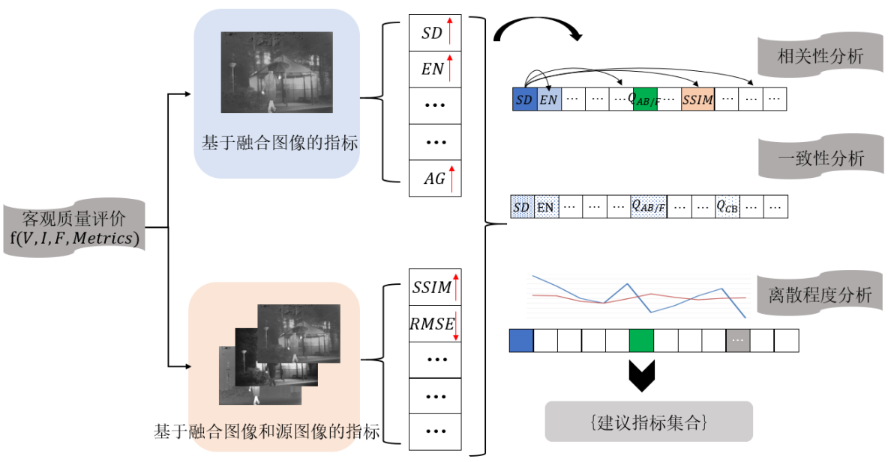

# Analysis of quality objective assessment metrics for visible and infrared image fusion
<a href="https://github.com/sunbinuestc/Analysis-of-quality-objective-assessment-metrics-for-visible-and-infrared-image-fusion/blob/main/README.md">Chinese Version</a>
## Objective
As a research branch in the field of image fusion, objective assessment metrics can overcome the limitations of subjective evaluation methods, which are often influenced by human psychological factors, environmental conditions, and visual characteristics. It can be utilized to evaluate algorithms and design parameters. The advantages of the proposed algorithms can be demonstrated through objective assessment metrics. However, there is still a lack of benchmarks and metrics in various application fields like visible and infrared image fusion. A couple of objective assessment metrics can be selected based on prior experience. To facilitate the comparative analysis for different fusion algorithms, our research is focused on a general method for objective assessment metrics and a set of recommended metrics for the fusion of visible and infrared images.
## Method
A new selecting method for objective assessment metrics is built. Our method consists of three parts: 1) correlation analysis, 2) consistency analysis and 3) discrete analysis. The Kendall correlation coefficient is utilized to perform correlation analysis for all objective assessment metrics. All the objective assessment metrics are clustered according to the value of the correlation coefficient: if the Kendall value of two metrics is higher than the threshold, the two metrics will be put into the same group. The Borda voting method is used in the consistency analysis. There is a ranking for all algorithms in terms of each metric value. An overall ranking is also generated by Borda voting method based on each single ranking of different metrics. The correlation coefficient is used to analyze the consistency between each single ranking and the overall ranking. The objective assessment metric has higher consistency if its correlation coefficient value is higher. Such experiments showed that the metric value will be fluctuated if the fusion quality is changed. A good metric should reflect the fusion quality of different algorithms clearly, so the metric value will cause a large fluctuation in terms of different fusion quality. The different fusion quality we illustrated is originated from multiple algorithms. The coefficient of variation is used to interpret the fluctuation because different objective assessment metrics match different measurement scales. The coefficient of variation reflects overall fluctuations under the influence of the measurement scale. Therefore, the final selected objective assessment metrics set has the following three characteristics: 1) high consistency, 2) high coefficient of variation and 3) non-same group. 
  <table width="456.80" border="0" cellpadding="0" cellspacing="0" style='width:342.60pt;border-collapse:collapse;table-layout:fixed;'>
   <col width="97.67" style='mso-width-source:userset;mso-width-alt:3125;'/>
   <col width="221.47" style='mso-width-source:userset;mso-width-alt:7086;'/>
   <col width="37.67" style='mso-width-source:userset;mso-width-alt:1205;'/>
   <col width="100" style='mso-width-source:userset;mso-width-alt:3200;'/>
   <tr height="18" style='height:13.50pt;'>
    <td class="xl65" height="18" width="356.80" colspan="3" style='height:13.50pt;width:267.60pt;border-right:.5pt solid windowtext;border-bottom:.5pt solid windowtext;' x:str>Metrics</td>
    <td class="xl66" width="100" style='width:75.00pt;' x:str>Key formula</td>
   </tr>
   <tr height="36" style='height:27.00pt;'>
    <td class="xl67" height="126" rowspan="5" style='height:94.50pt;border-right:.5pt solid windowtext;border-bottom:.5pt solid windowtext;' x:str>Evaluation Metrics Based on the Quality of Fused Images</td>
    <td class="xl67" x:str>Standard Deviation</td>
    <td class="xl68" x:str><a href="https://github.com/sunbinuestc/Analysis-of-quality-objective-assessment-metrics-for-visible-and-infrared-image-fusion/blob/main/code/Matlab/VIFB/metrics/metricsVariance.m" target="_parent">SD</a></td>
    <td class="xl69" x:str>$$SD=\sqrt {\sum ^{M}_{i=1} {\sum ^{N}_{j=1} {{(F(i,j)-\mu )}^{2}}}}$$</td>
   </tr>
   <tr height="18" style='height:13.50pt;'>
    <td class="xl67" x:str>Edge Intensity</td>
    <td class="xl68" x:str><a href="https://github.com/sunbinuestc/Analysis-of-quality-objective-assessment-metrics-for-visible-and-infrared-image-fusion/blob/main/code/Matlab/VIFB/metrics/metricsEdge_intensity.m" target="_parent">EI</a></td>
    <td class="xl69" x:str>$$EI=\frac {\sqrt {\sum ^{M}_{i=1} {\sum ^{N}_{j=1} {({s}_{x}{(i,j)}^{2}+{s}_{y}{(i,j)}^{2})}}}} {M\times N}$$</td>
   </tr>
   <tr height="18" style='height:13.50pt;'>
    <td class="xl67" x:str>Entropy</td>
    <td class="xl68" x:str><a href="https://github.com/sunbinuestc/Analysis-of-quality-objective-assessment-metrics-for-visible-and-infrared-image-fusion/blob/main/code/Matlab/VIFB/metrics/metricsEntropy.m" target="_parent">EN</a></td>
    <td class="xl69" x:str>$$E N_{F}=-\sum_{f=1}^{n} p_{f} \log p_{f}$$</td>
   </tr>
   <tr height="36" style='height:27.00pt;'>
    <td class="xl67" x:str>Average Gradient</td>
    <td class="xl68" x:str><a href="https://github.com/sunbinuestc/Analysis-of-quality-objective-assessment-metrics-for-visible-and-infrared-image-fusion/blob/main/code/Matlab/VIFB/metrics/metricsAvg_gradient.m" target="_parent">AG</a></td>
    <td class="xl69" x:str>$$A G=\frac{1}{(M-1)(N-1)} \times \sum_{i=1}^{M-1} \sum_{j=1}^{N-1} \times 
\sqrt{\frac{(F(i+1 ,j)-F(i ,j))^{2}+(F(i, j+1)-F(i ,j))^{2}}{2}}$$</td>
   </tr>
   <tr height="18" style='height:13.50pt;'>
    <td class="xl67" x:str>Space Frequency</td>
    <td class="xl68" x:str><a href="https://github.com/sunbinuestc/Analysis-of-quality-objective-assessment-metrics-for-visible-and-infrared-image-fusion/blob/main/code/Matlab/VIFB/metrics/metricsSpatial_frequency.m" target="_parent">SF</a></td>
    <td class="xl69" x:str>$$S F=\sqrt{\left(F_{R}\right)^{2}+\left(F_{C}\right)^{2}+\left(F_{M D}\right)^{2}+\left(F_{S D}\right)^{2}}$$</td>
   </tr>
   <tr height="36" style='height:27.00pt;'>
    <td class="xl67" height="240" rowspan="8" style='height:180.00pt;border-right:.5pt solid windowtext;border-bottom:.5pt solid windowtext;' x:str>Evaluation Metrics Based on Source and Fused Images</td>
    <td class="xl67" x:str>Root Mean Squared Error</td>
    <td class="xl68" x:str><a href="https://github.com/sunbinuestc/Analysis-of-quality-objective-assessment-metrics-for-visible-and-infrared-image-fusion/blob/main/code/Matlab/VIFB/metrics/metricsRmse.m" target="_parent">RMSE</a></td>
    <td class="xl69" x:str>$$R M S E=\frac{R M S E_{A F}+R M S E_{B F}}{2}$$</td>
   </tr>
   <tr height="36" style='height:27.00pt;'>
    <td class="xl67" x:str>Peak Signal to Noise Ratio</td>
    <td class="xl68" x:str><a href="https://github.com/sunbinuestc/Analysis-of-quality-objective-assessment-metrics-for-visible-and-infrared-image-fusion/blob/main/code/Matlab/VIFB/metrics/metricsPsnr.m" target="_parent">PSNR</a></td>
    <td class="xl69" x:str>$$\text { PSNR }=10 \lg \frac{[\max (F(i, j))-\min (F(i, j))]^{2}}{M S E}$$</td>
   </tr>
   <tr height="18" style='height:13.50pt;'>
    <td class="xl67" x:str>Cross Entropy</td>
    <td class="xl68" x:str><a href="https://github.com/sunbinuestc/Analysis-of-quality-objective-assessment-metrics-for-visible-and-infrared-image-fusion/blob/main/code/Matlab/VIFB/metrics/metricsCross_entropy.m" target="_parent">CE</a></td>
    <td class="xl69" x:str>$$C E=\sqrt{\frac{\left(C E_{F}^{A}\right)^{2}+\left(C E_{F}^{B}\right)^{2}}{2}}$$</td>
   </tr>
   <tr height="36" style='height:27.00pt;'>
    <td class="xl67" x:str>Mutual Information</td>
    <td class="xl68" x:str><a href="https://github.com/sunbinuestc/Analysis-of-quality-objective-assessment-metrics-for-visible-and-infrared-image-fusion/blob/main/code/Matlab/VIFB/metrics/metricsMutinf.m" target="_parent">MI</a></td>
    <td class="xl69" x:str>$$M I_{F}^{A B}=I_{F A}(f ; a)+I_{F B}(f ; b)$$</td>
   </tr>
   <tr height="36" style='height:27.00pt;'>
    <td class="xl67" x:str>Edge Preservation</td>
    <td class="xl68" x:str><a href="https://github.com/sunbinuestc/Analysis-of-quality-objective-assessment-metrics-for-visible-and-infrared-image-fusion/blob/main/code/Matlab/VIFB/metrics/metricsQabf.m" target="_parent">QAB/F</a></td>
    <td class="xl69" x:str>$$Q^{A B / F}=\frac{\sum_{i=1}^{N} \sum_{j=1}^{M} Q^{A F}(i ,j) \omega^{A}(i ,j)+Q^{B F}(i ,j) \omega^{B}(i ,j)}{\sum_{i=1}^{N} \sum_{j=1}^{M}\left(\omega^{A}(i ,j)+\omega^{B}(i ,j)\right)}$$</td>
   </tr>
   <tr height="36" style='height:27.00pt;'>
    <td class="xl67" x:str>Structural Similarity Index Measure</td>
    <td class="xl68" x:str><a href="https://github.com/sunbinuestc/Analysis-of-quality-objective-assessment-metrics-for-visible-and-infrared-image-fusion/blob/main/code/Matlab/VIFB/metrics/metricsSsim.m" target="_parent">SSIM</a></td>
    <td class="xl69" x:str>$$S S I M_{A F}=l(\boldsymbol{A}, \boldsymbol{F}) \times c(\boldsymbol{A}, \boldsymbol{F}) \times s(\boldsymbol{A}, \boldsymbol{F})$$</td>
   </tr>
   <tr height="21" style='height:15.75pt;'>
    <td class="xl67" x:str>Chen-Varshney</td>
    <td class="xl68" x:str><a href="https://github.com/sunbinuestc/Analysis-of-quality-objective-assessment-metrics-for-visible-and-infrared-image-fusion/blob/main/code/Matlab/VIFB/metrics/metricsQabf.m" target="_parent">QCV</a></td>
    <td class="xl69" x:str>$$Q_{\mathrm{cv}}= 
\frac{\sum_{l=1}^{L}\left(\lambda\left(\boldsymbol{A}^{w_{l}}\right) D\left(\boldsymbol{A}^{w_{l}} ,\boldsymbol{F}^{w_{l}}\right)+\lambda\left(\boldsymbol{B}^{w_{l}}\right) D\left(\boldsymbol{B}^{w_{l}} ,\boldsymbol{F}^{w_{l}}\right)\right)}{\sum_{l=1}^{L}\left(\lambda\left(\boldsymbol{A}^{w_{l}}\right)+\lambda\left(\boldsymbol{B}^{w_{l}}\right)\right)}$$</td>
   </tr>
   <tr height="21" style='height:15.75pt;'>
    <td class="xl67" x:str>Chen-Blum</td>
    <td class="xl68" x:str><a href="https://github.com/sunbinuestc/Analysis-of-quality-objective-assessment-metrics-for-visible-and-infrared-image-fusion/blob/main/code/Matlab/VIFB/metrics/metricsQcb.m" target="_parent">QCB</a></td>
    <td class="xl69" x:str>$$Q_{\mathrm{GQM}}(i ,j)=\lambda_{A}(i ,j) Q_{A F}(i ,j)+\lambda_{B}(i ,j) Q_{B F}(i ,j)$$</td>
   </tr>
  </table>
## Result
The experiments are conducted on the visible and infrared fusion benchmark (VIFB) dataset. The experiments are segmented into two groups in terms of the visible images in the dataset in related to grayscale images and RGB color images. The recommended objective assessment metric set is under the fusion of visible and infrared image, color visible and infrared image fusion: {standard deviation (SD), QAB/F} or {SD, QCB}; gray visible and infrared image fusion: {SD, QAB/F} or {QCB} . Under the fusion of color visible and infrared image, both of QAB/F and QCB had good consistency and coefficient of variation within the same group. It did not make much difference to choose each of them. Combining the results of the two sets of experiments, {SD, QAB/F} is applied to visible and infrared image fusion. SD is focused on evaluating the contrast information of the fused image, which can intuitively reflect the quality of the fusion of visible and infrared images. QAB/F is focused on evaluating the edge details. The comparative analysis shows that the algorithms filtered by two objective assessment metrics are similar to the individual subjective evaluation results. The objective assessment metric set selected by our method can be used as a basis for evaluating the performances of visible and infrared fusion algorithms. Compared to the existing methods, this method covers more fusion algorithms and objective assessment metrics without subjective evaluation results.
## Conclusion
A general selecting method for objective assessment metrics is proposed. The method is not only matched for the fusion of visible and infrared images, but also applies to image fusion in other scenes. Our quick-response method can screen out the most representative objective assessment metric in a scene. Based on the benchmark of visible and infrared image fusion, the recommended representative objective assessment metrics of visible and infrared image fusion are SD and QAB/F.

Figure.1 Analysis flow of objective assessment metrics for image fusion

The process of objective metric analysis of image fusion is shown in Figure 1. Metric grouping is obtained through correlation analysis and clustering, and a voting method that is not disturbed by grouping is designed to count the comprehensive ranking of algorithms. The correlation between single metric ranking and comprehensive ranking is analyzed to obtain a set of metrics with high consistency. The degree of fluctuation of metrics with different algorithms is analyzed by  coefficient of variation, and metrics that fully reflect the differences between different algorithms are selected. Based on the image fusion experiment, the {recommended index set} suitable for visible and infrared image fusion is obtained by combining correlation analysis, consistency analysis and discrete degree analysis.

The recommended metric set obtained for limited samples under experimental settings is a non-exclusive metric recommendation, that is, when selecting multiple metrics to comprehensively evaluate the fusion results from different angles, it is recommended to select rather than only select the metric set. Researchers in related fields can extend the method to multi-focus image, medical image and remote sensing image fusion, and obtain objective assessment metric recommendations for image fusion suitable for different application scenarios.
## Code usage
### Matlab
In the `code/Matlab` folder, the metric calculation code is stored in the `VIFB` folder with relevant instructions. The metric analysis code is stored in the `metric analysis` folder, and the file path processed by the `xlsread` and `xlswrite` functions needs to be modified. The various metrics of each method should be stored in the xlsx file in the following format.

<table>
  <tr>
    <th></th>
    <th>EN</th>
    <th>SSIM</th>
    <th>PSNR</th>
    <th>......</th>
    <th>Borda rank</th>
  </tr>
  <tr>
    <th>DenseFuse</th>
    <td>xxx</td>
    <td>xxx</td>
    <td>xxx</td>
    <td>xxx</td>
    <td>xxx</td>
  </tr>
  <tr>
    <th>DIDFuse</th>
    <td>xxx</td>
    <td>xxx</td>
    <td>xxx</td>
    <td>xxx</td>
    <td>xxx</td>
  </tr>
  <tr>
    <th>......</th>
    <td>xxx</td>
    <td>xxx</td>
    <td>xxx</td>
    <td>xxx</td>
    <td>xxx</td>
  </tr>
</table>

### Python
In the `code/Python` folder, the metric calculation code is stored in the `metric calculation` folder, and the metric analysis code is stored in the `metric analysis` folder, both with relevant instructions.

## Citation
Bin Sun, Yunxiang Gao, Wuwei Zhuge, Zixuan Wang. Analysis of quality objective assessment metrics for visible and infrared image fusion[J]. Journal of Image and Graphics, 2023,28(1):144-155. DOI： 10.11834/jig.210719.

Chinese Journal of Image and Graphics Official Link: <a href="https://www.cjig.cn/zh/article/doi/10.11834/jig.210719/">Analysis of quality objective assessment metrics for visible and infrared image fusion(cjig.cn)</a>
